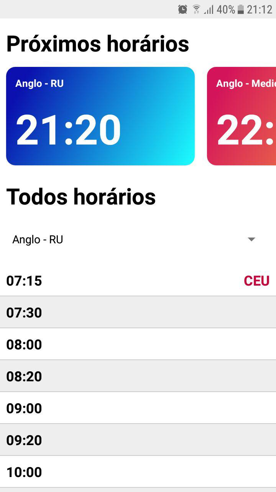

# Bus UFPel

O objetivo deste projeto é disponibilizar de forma simples e organazada or horários das linhas do ônibus institucional da UFPel.
O projeto é sem fins lucrativos, desenvolvido exclusivamente para ajudar a vida dos acadêmicos da Universidade.

## Contribua!

Os dados que alimentam este aplicativo estão armazenados [neste repositório no GitHub](https://github.com/gustavofsantos/horarios-onibus-institucional-ufpel) no formato JSON. O aplicativo consulta o arquivo de tempos em tempos para atualizar a base de dados local. Se você notar alguma diferença com os horários oficiais, o que pode acontecer caso a UFPel altere os horários dos ônibus institucionais, faça um *pull request* no repositório ou avise-me por e-mail.

